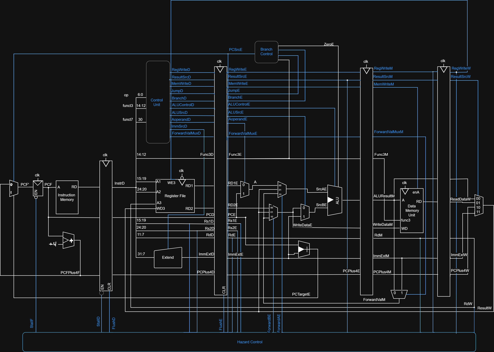
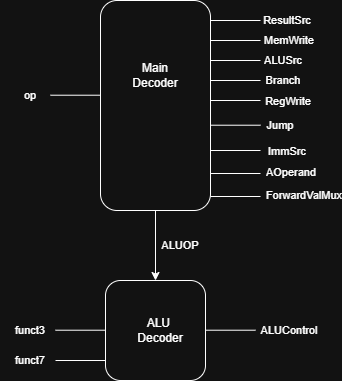
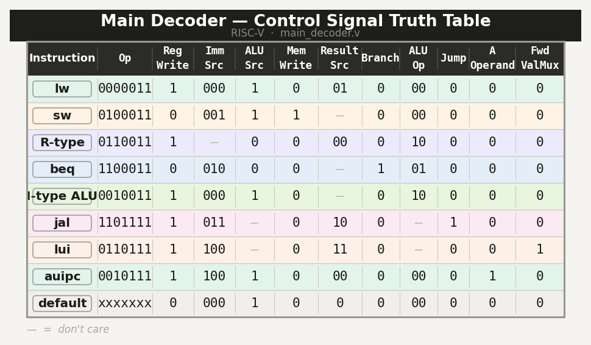
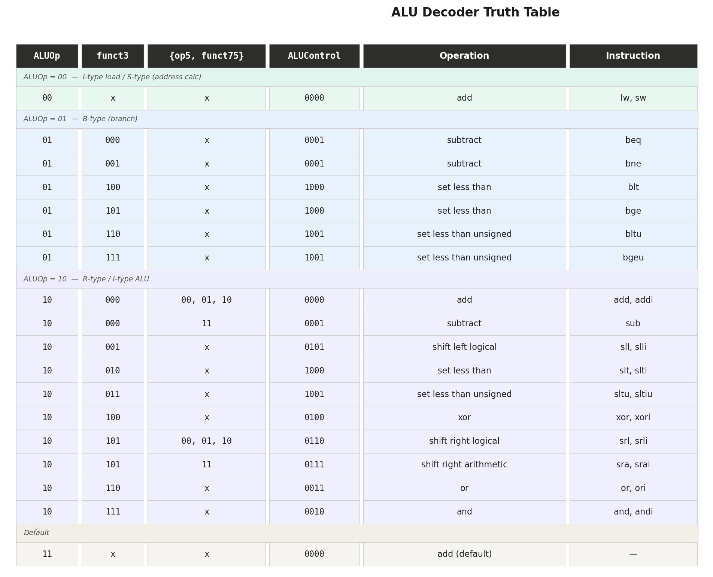
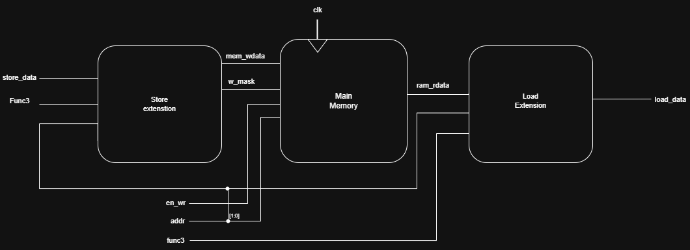
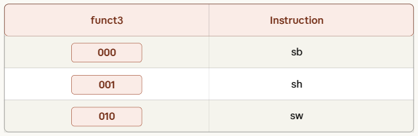

# 🖥️ 32-bit RISC-V Pipelined Processor

**A fully synthesizable 32-bit RISC-V processor implementing the RV32I base integer instruction set with a classic 5-stage pipeline, hazard control, data forwarding, and full memory subsystem.**

---

## 📸 Complete Processor Schematic

> Full RTL-level block diagram showing all pipeline stages, control signals, forwarding paths, and hazard control.

---

## 📋 Table of Contents

- [Overview](#overview)
- [Key Features](#-key-features)
- [Instruction Format](#-risc-v-instruction-format)
- [Control Unit](#-control-unit--two-level-decoder)
- [Memory Subsystem](#-memory-subsystem)
- [Hazard Handling](#-hazard-handling)
- [Project Structure](#-project-structure)
- [Getting Started](#-getting-started)
- [Performance](#-performance-summary)

---

## 🔍 Overview

This project implements a **fully pipelined 32-bit RISC-V processor** in Verilog, based on the RV32I base integer instruction set. The processor uses a classic **5-stage pipeline** (IF → ID → EX → MEM → WB) with a complete hazard control unit, full data forwarding, and a byte/half-word addressable memory system supporting both signed and unsigned loads.

---

## ✨ Key Features

### 🔁 5-Stage Pipeline Architecture

The processor is divided into five pipeline stages with dedicated inter-stage registers:

Each stage has dedicated pipeline registers (`IF/ID`, `ID/EX`, `EX/MEM`, `MEM/WB`) to latch data between cycles, enabling up to 5 instructions to execute concurrently.

---

### 📐 RISC-V Instruction Format

All instructions are exactly 32 bits wide, encoded in one of 6 formats:

| Format | Fields | Used By |
|--------|--------|---------|
| **R** | funct7, rs2, rs1, funct3, rd, opcode | ADD, SUB, AND, OR, XOR, SLL, SRL, SRA, SLT, SLTU |
| **I** | imm[11:0], rs1, funct3, rd, opcode | LW, ADDI, ANDI, ORI, JALR, etc. |
| **S** | imm[11:5], rs2, rs1, funct3, imm[4:0], opcode | SW, SH, SB |
| **B** | imm, rs2, rs1, funct3, imm, opcode | BEQ, BNE, BLT, BGE, BLTU, BGEU |
| **U** | imm[31:12], rd, opcode | LUI, AUIPC |
| **J** | imm, rd, opcode | JAL |

#### Full RV32I Instruction Support

| Type | Instructions |
|------|-------------|
| **R-Type** | `ADD` `SUB` `AND` `OR` `XOR` `SLL` `SRL` `SRA` `SLT` `SLTU` |
| **I-Type** | `ADDI` `ANDI` `ORI` `XORI` `SLTI` `SLTIU` `SLLI` `SRLI` `SRAI` `LW` `LH` `LB` `LHU` `LBU` `JALR` |
| **S-Type** | `SW` `SH` `SB` |
| **B-Type** | `BEQ` `BNE` `BLT` `BGE` `BLTU` `BGEU` |
| **U-Type** | `LUI` `AUIPC` |
| **J-Type** | `JAL` |

---

### 🧠 Control Unit — Two-Level Decoder

The control unit is composed of two cooperating decoders:

#### Main Decoder

Takes the 7-bit opcode and generates all pipeline control signals:

#### ALU Decoder

Uses `ALUOp` + `funct3` + `funct7[5]` to select the exact ALU operation:

---

### 🗃️ Memory Subsystem

The memory unit supports **byte**, **half-word**, and **word** accesses with both signed and unsigned loads/stores.

#### Supported Load Instructions

#### Supported Store Instructions

**Store Extension — Byte-level write mask:**

**Load Extension — Sign/Zero extension:**

---

### 🛡️ Hazard Handling

#### Data Forwarding Unit

Resolves **RAW (Read-After-Write) hazards** by forwarding results from later pipeline stages back to the EX stage — eliminating most stalls.

#### Load-Use Stall & Branch Flush

#### Branch Resolution (EX Stage)

Branches resolve in the **EX stage** using a dedicated `Branch_Control` module:

| Branch | Condition | ALU Operation | Zero Meaning |
|--------|-----------|---------------|--------------|
| `beq`  | rs1 == rs2 | subtract | result == 0 |
| `bne`  | rs1 ≠ rs2  | subtract | result ≠ 0 |
| `blt`  | rs1 < rs2  | slt      | result == 0 |
| `bge`  | rs1 ≥ rs2  | slt      | result == 1 |
| `bltu` | rs1 < rs2 (unsigned) | sltu | result == 0 |
| `bgeu` | rs1 ≥ rs2 (unsigned) | sltu | result == 1 |

---

### 📦 Register File

- **32 × 32-bit** general-purpose registers (`x0`–`x31`)
- `x0` permanently hardwired to `0`
- **Dual asynchronous read ports** (rs1, rs2)
- **Single synchronous write port** (rd) — writes on rising clock edge

---

### 🔢 Immediate Extender

Handles all 5 immediate encoding formats with correct sign-extension:

---

## 🗂️ Project Structure

---

## 🚀 Getting Started

### Prerequisites

- [Icarus Verilog](http://iverilog.icarus.com/) **or** Xilinx Vivado / ModelSim
- [GTKWave](http://gtkwave.sourceforge.net/) for waveform viewing *(optional)*

### Simulation with Icarus Verilog

### Simulation with Vivado

1. Create a new RTL project
2. Add all `.v` files from `src/` as **Design Sources**
3. Add `tb/tb_riscv_main.v` as **Simulation Source**
4. Set top module to `riscv_main`
5. Run **Behavioral Simulation**

---

## 📊 Performance Summary

| Parameter | Value |
|-----------|-------|
| Architecture | RISC-V RV32I |
| Data Width | 32-bit |
| Pipeline Stages | 5 (IF, ID, EX, MEM, WB) |
| Forwarding | ✅ Full — EX/MEM → EX, MEM/WB → EX |
| Load-Use Stall | ✅ 1 cycle, auto-inserted |
| Branch Penalty | 1 cycle (resolved in EX stage) |
| Branch Prediction | Static: not-taken |
| Memory Architecture | Harvard (separate IMEM / DMEM) |
| Load Types | `lb` `lh` `lw` `lbu` `lhu` |
| Store Types | `sb` `sh` `sw` |
| Ideal CPI | ~1.0 |

---

## 📚 References

- [RISC-V ISA Specification v2.2](https://riscv.org/wp-content/uploads/2017/05/riscv-spec-v2.2.pdf)
- Patterson & Hennessy — *Computer Organization and Design: RISC-V Edition*

---

  Built with ❤️ — RISC-V RV32I Pipelined Processor in Verilog

